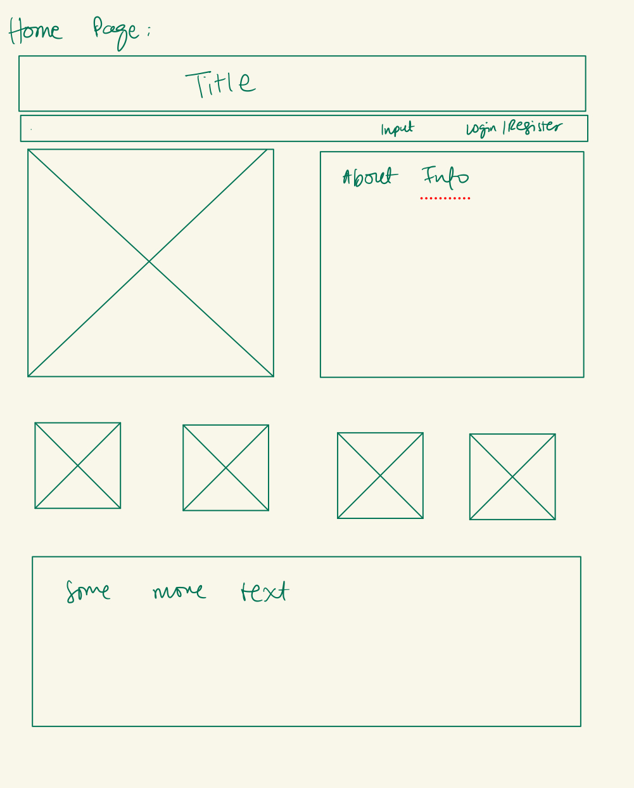
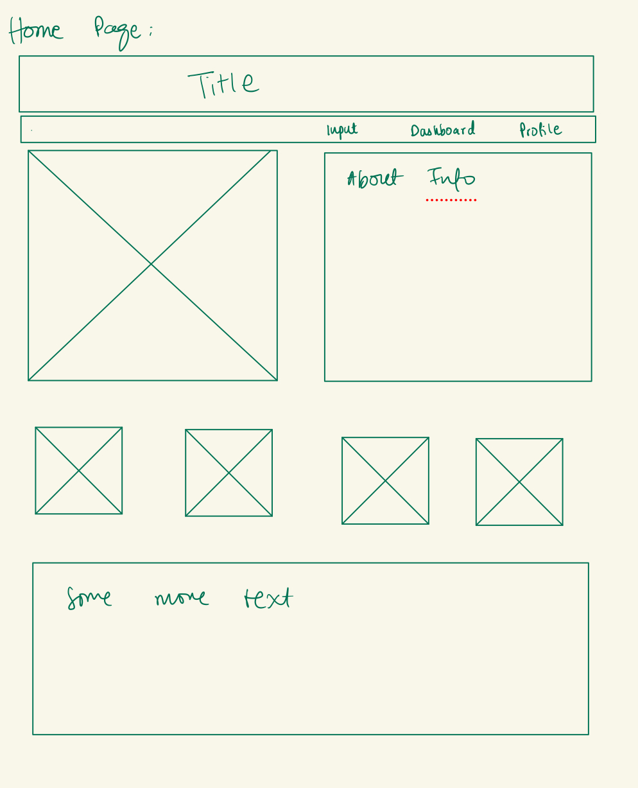
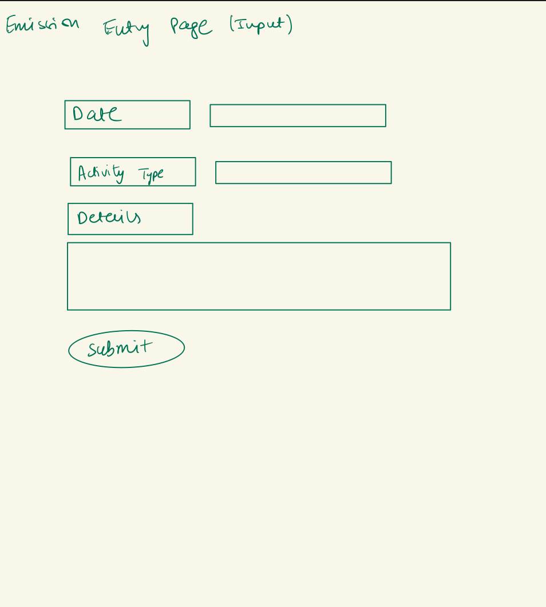
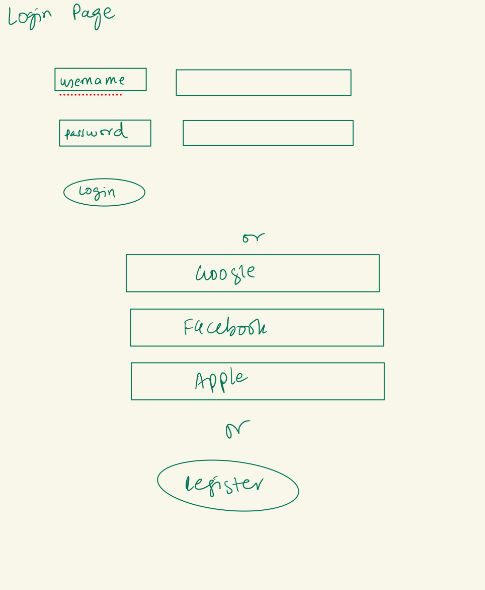
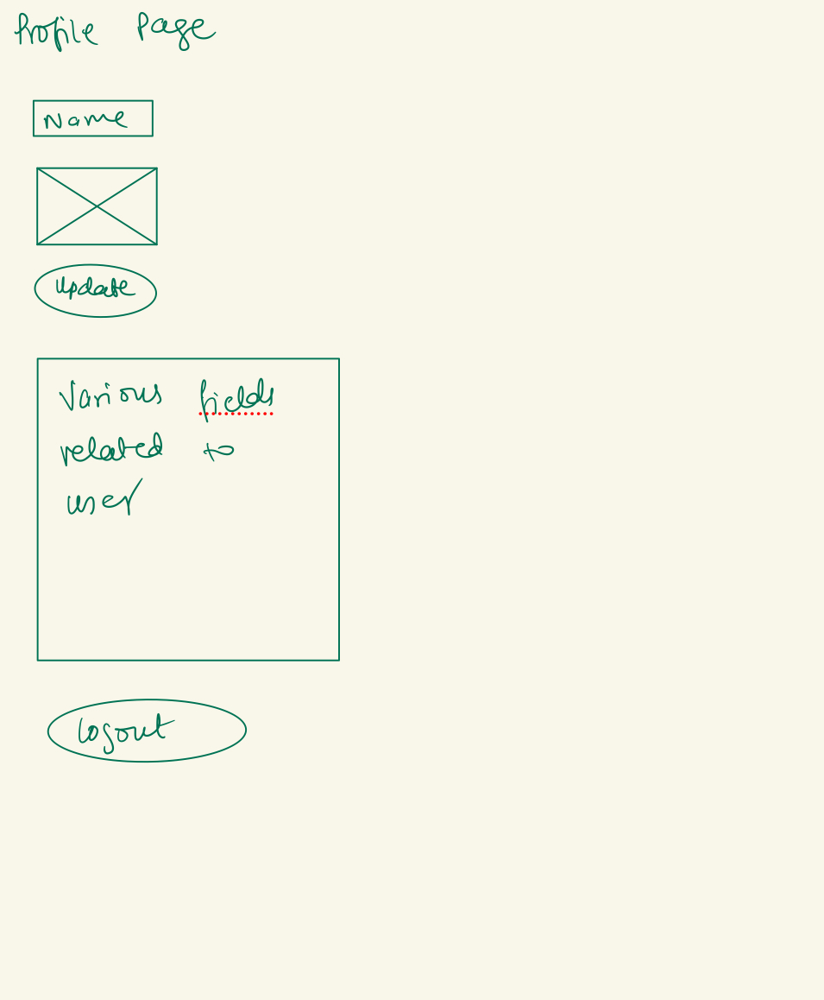
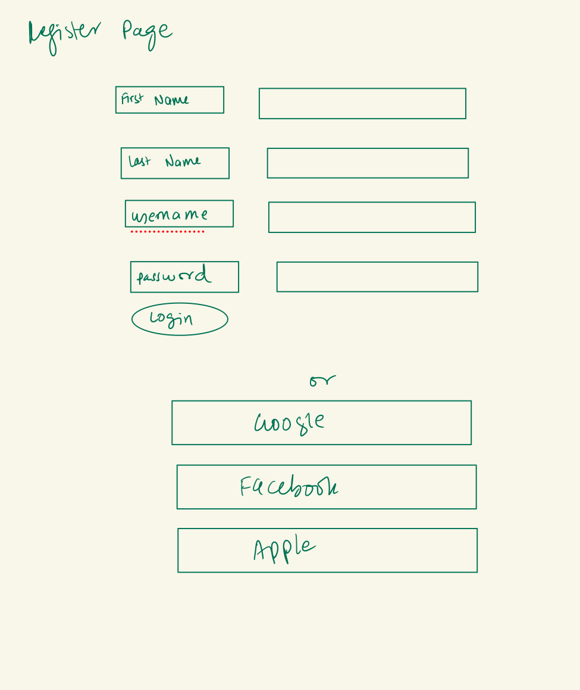
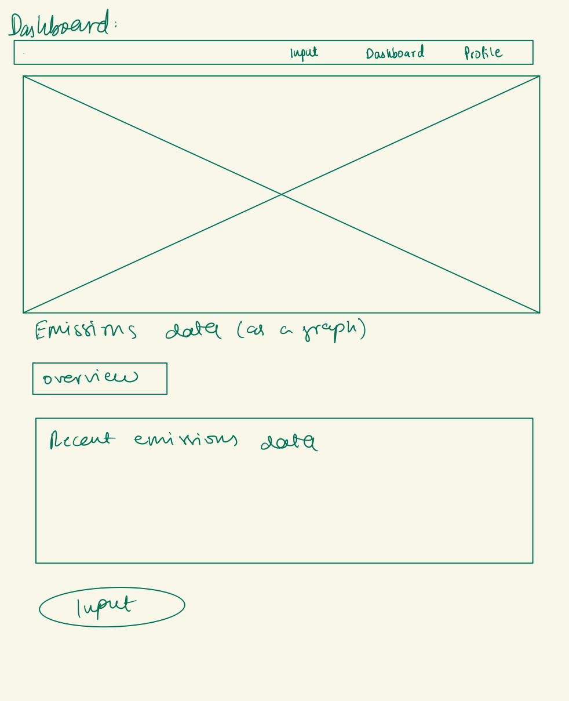

The content below is an example project proposal / requirements document. Replace the text below the lines marked "__TODO__" with details specific to your project. Remove the "TODO" lines.

(__TODO__: The Carbon Dioxide Emission Calculator)

# Shoppy Shoperson 

## Overview

(__TODO__: a brief one or two paragraph, high-level description of your project)

The Carbon Dioxide Emission Calculator is designed to help individuals and organizations estimate their carbon footprint based on daily activities such as transportation, home energy use, and lifestyle choices. By inputting simple data about their daily routines, users can see how their actions contribute to carbon emissions, enabling them to make informed decisions about reducing their environmental impact.


## Data Model

(__TODO__: a description of your application's data and their relationships to each other) 


The application will store Users and Emission Entries:

* Users can have multiple Emission Entries (via references)
* Each Emission Entry corresponds to a single user, but contains detailed records of different emission categories embedded within each entry.

(__TODO__: sample documents)

An Example User:

```javascript
{
  username: "ecoUser",
  hash: "hashedPasswordExample",  // This would be a password hash for user authentication
  emissionEntries: [
    // An array of references to Emission Entry documents
  ]
}

```

An Example List with Embedded Items:

```javascript
{
  userId:   // Reference to the User object who owns this entry
  date: "2023-10-10",
  emissions: {
    transportation: {
      amount: 300, 
      unit: "kg of CO2", 
      description: "Car and public transportation"
    },
    electricity: {
      amount: 150, 
      unit: "kg of CO2",
      description: "Home electricity usage"
    },
    waste: {
      amount: 45, 
      unit: "kg of CO2",
      description: "Recyclable and non-recyclable waste"
    },
    water: {
      amount: 80, 
      unit: "kg of CO2",
      description: "Water supply and treatment"
    }
    // might add more
  },
  createdAt:  // Timestamp of when the entry was created
}

```


## [Link to Commented First Draft Schema](https://github.com/nyu-csci-ua-0467-001-002-fall-2024/final-project-ns5376/blob/master/db.mjs) 

(__TODO__: create a first draft of your Schemas in db.mjs and link to it)

## Wireframes

(__TODO__: wireframes for all of the pages on your site; they can be as simple as photos of drawings or you can use a tool like Balsamiq, Omnigraffle, etc.)



/home2/ home page for when not logged in 
 
/input/ page to enter emission data







## Site map

(__TODO__: draw out a site map that shows how pages are related to each other)


## User Stories or Use Cases

(__TODO__: write out how your application will be used through [user stories](http://en.wikipedia.org/wiki/User_story#Format) and / or [use cases](https://en.wikipedia.org/wiki/Use_case))

* As a new visitor, I want to understand what the application does, so that I can decide if I want to use it.
* As a new user, I want to easily register for an account, so that I can securely store and track my carbon emission data.
* As a user, I want to log in to my account, so that I can access my personal emission data.
* As a user, I want to input data regarding my daily activities, so that I can calculate my carbon emissions for those activities.
* As a user, I want to view a summary of my emissions over different periods (daily, weekly, monthly), so that I can understand my emission trends.
* As a user, I want to modify or delete previously entered emission data, so that I can correct mistakes and keep my data accurate.
* As a user, I want to be able to change my account settings, so that I can update my personal information or password.
* As a user, I want to log out of the application, so that I can ensure no one else has access to my data on my device.
* As an administrator, I want to see statistics about user engagement and data entries, so that I can gauge the success of the application.

## Research Topics

(__TODO__: the research topics that you're planning on working on along with their point values... and the total points of research topics listed)

* (2 points) Integration of Climatiq API
 Enables accurate emissions data retrieval based on user activities for precise carbon calculations.
(3 points) Unit Testing with JavaScript (Jest)
* Ensures core functions, especially emission calculations, work reliably under various scenarios.
(3 points) User Authentication Using OAuth (Google, Facebook, Apple)
* Allows secure and convenient login options for users via popular social accounts.
(2 points) Integrate ESLint into Your Workflow
* Maintains code quality, making your application more maintainable and secure, especially important when handling sensitive information like tokens and API data.
Total Points: 10 Points


## [Link to Initial Main Project File](app.mjs) 

(__TODO__: create a skeleton Express application with a package.json, app.mjs, views folder, etc. ... and link to your initial app.mjs)

## Annotations / References Used

(__TODO__: list any tutorials/references/etc. that you've based your code off of)

1. [passport.js authentication docs](http://passportjs.org/docs) - (add link to source code that was based on this)
2. [tutorial on vue.js](https://vuejs.org/v2/guide/) - (add link to source code that was based on this)

